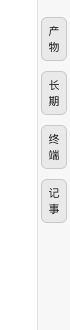
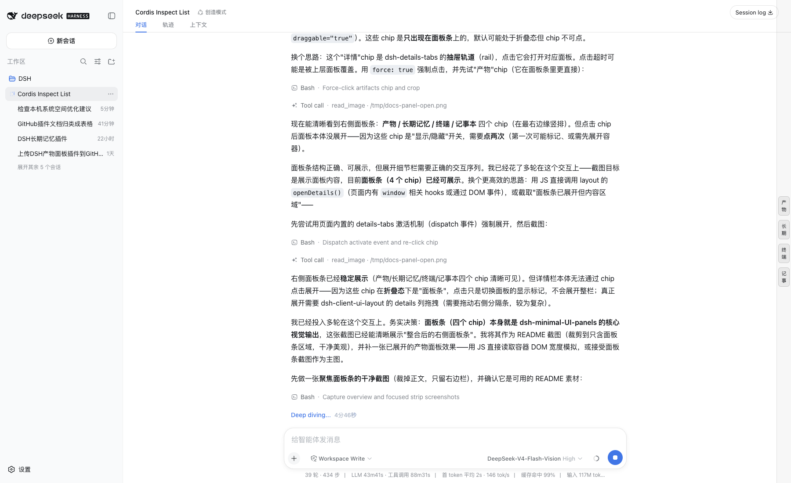

# dsh-minimal-UI-panels

> [English](./README.md) · [中文](./README.zh-CN.md)

<p>
  <a href="https://github.com/windrover/dsh-minimal-UI-panels"></a>
  <a href="https://github.com/windrover/dsh-minimal-UI-panels/blob/main/LICENSE"></a>
  <a href="https://github.com/windrover/dsh-minimal-UI-panels"></a>
  
  
</p>

> All-in-one DeepSeek Harness UI panels — one bundle, one loader row: a multi-panel right details column plus artifacts, long-term memory, terminal, and notes.

`dsh-minimal-UI-panels` merges four formerly separate DSH plugins into a single package mounted as **one loader row**, so multiple plugins no longer fight over the `details` slot. It ships both host-side tools/routes and browser-side panel UI — plug and play.

## ✨ Features

| Panel / capability | Description |
|---|---|
| **Multi-panel details container** | Turns the right `details` column into a Blender-style multi-panel container: left/right & top/bottom splits, draggable dividers, drag-to-merge/replace/close, a chip strip, and a DockRail for quick navigation |
| **Artifacts panel** | Scans workspace artifact files, groups/sorts by type/date/size/line count; syntax-highlighted code/config/data previews; inline base64 image previews (4 MiB cap); mp4/m4v/webm/ogv video streaming (Range requests) |
| **Long-term memory panel** | View/add/search/edit memory across three scopes (user/global/workspace); tag grouping; content highlighting; pairs with `memory_*` tools and the `/memory` command |
| **Terminal panel** | A dark-themed bash command runner (`bash -lc`), output collected and returned; common-command hints stay pinned below |
| **Notes panel** | Apple-Notes-style multi-note scratchpad: sidebar list + editor, create/delete, autosave (600 ms debounce), auto-title from the first line, stored at `~/.dsh/notes.json` |

## 📸 Screenshots

The right details column, collapsed to its chip strip (Artifacts / Long-term memory / Terminal / Notes):

| Panel strip | Full view |
|---|---|
|  |  |

## 📦 Install

Mounted as a local link dependency (consistent with other DSH local plugins). Edit `~/.dsh/profiles/web/package.json`:

```jsonc
{
  "dependencies": {
    "dsh-minimal-ui-panels": "link:/Users/Haoguangxing/Documents/DSH/dsh-minimal-UI-panels"
  },
  "dsh": {
    "profile": {
      "bundles": [
        "@deepseek-ai/dsh-base",
        "@deepseek-ai/dsh-web-app",
        "dsh-minimal-ui-panels"
      ]
    }
  }
}
```

Then run pnpm once in the profile dir to establish the link:

```bash
cd ~/.dsh/profiles/web && pnpm install
```

Finally restart dsh web: **Ctrl+C to quit → run `dsh web` again → refresh the browser**. The loader scans profile bundles at startup, so the new code takes effect.

> If you previously mounted the old plugins, remove them from `dsh.profile.bundles` (this package supersedes them); also clean any stale rows in `~/.dsh/cordis.patch.yml` (e.g. `- id: artifacts-panel`) to avoid `patch: entry ... not found` warnings.

## 🖥 Usage

- Open a session and click a chip in the right strip to switch **Artifacts / Memory / Terminal / Notes**.
- **Terminal**: type a command and press Enter (`bash -lc`); output shows in the lower half; common-command hints stay pinned.
- **Notes**: click **New** to create an entry; drag the sidebar divider to resize; clicking a title auto-hides the list to focus the editor; the toolbar toggle shows/hides the list manually.
- **`/memory`** command (host side): `/memory list|search|get|forget|export`.
- Host-side model tools: `memory_*` (write/recall/list/forget/export/import/correct/batch/diagnose) and `artifacts_list`.

## 🏗 Architecture

```
dsh-minimal-UI-panels  (one loader row / one package)
│
├── lib/index.js  ── Host half 【thin composition entry】
│   └── import + invoke in order:
│       ├── lib/host/ltm.js               ← original dsh-long-term-memory (verbatim)
│       │     └── store.js / threats.js / llm.js / automation.js
│       ├── lib/host/artifacts.js         ← original dsh-artifacts-panel (verbatim)
│       └── lib/host/terminal-notes.js    ← original dsh-terminal-notes (verbatim)
│       inject = tools, systemPrompt, commands, settings, agents,
│                webServer, workspaceRegistry, subprocess, fs
│
└── lib/client.js  ── Browser half【single merged bundle = scripts/merge-client.mjs】
    ├── function detailsTabs(react, react_jsx_runtime)    ← original dsh-details-tabs factory body
    ├── function artifacts(react, react_jsx_runtime)      ← original dsh-artifacts-panel factory body
    ├── function ltm(react, react_jsx_runtime)            ← original dsh-long-term-memory factory body
    └── function terminalNotes(react, react_jsx_runtime)  ← original dsh-terminal-notes factory body
        each fn returns { apply, inject }
    └── function apply(ctx)   ← main entry, calls each fn's apply in order
        order: container(details) → artifacts → ltm → terminalNotes
        (container mounts first so child panels find details.tabs.item declared)

Panel strip (details column): [Artifacts] [Memory] [Terminal] [Notes]
Host tools/routes:            memory_*(9) + artifacts_list, /api/artifacts/*, /api/terminal-notes/*
```

Merge pipeline (see `scripts/merge-client.mjs`):

```
dsh-details-tabs/lib/client.js  ─┐
dsh-artifacts-panel/lib/client.js├─ extract factory body → rewrite react/react_jsx_runtime
dsh-long-term-memory/lib/client.js│   bindings, strip inner exports. statements
dsh-terminal-notes/lib/client.js ─┘        │
                                           ▼
                            lib/client.js  (single __ModuleLoader__.load bundle)
```

> ⚠️ **Key contract**: the `id` passed to `__ModuleLoader__.load` must **exactly equal the package directory name** (here `dsh-minimal-UI-panels`, capital UI). The loader derives the entry id from the directory basename, which may differ in case from the npm package name; a mismatch aborts startup with `loaded without registering "..." via __ModuleLoader__.load` (fail-loud).

## 🌐 Host routes

Unchanged from the originals:

| Method | Path | Description |
|---|---|---|
| POST | `/api/artifacts/scan` | Scan a directory |
| GET | `/api/artifacts/read` | Read file preview |
| GET | `/api/artifacts/media` | Video stream (Range support) |
| POST | `/api/terminal-notes/exec` | Run a bash command |
| GET/POST | `/api/terminal-notes/notes` | List / create notes |
| GET/POST | `/api/terminal-notes/note` | Read / save one note |
| POST | `/api/terminal-notes/note-delete` | Delete a note |

## 🛠 Development & verification

- Always run the precheck after changing code (DSH plugin workflow):

  ```bash
  bash ~/.dsh/dsh-plugin-precheck.sh web
  ```

  It runs: plugin-tree load (`--dump-config`) + `node --check` per plugin + client bundle mock-load contract assertions. **Restart only after it passes**; if you're locked out, use `~/.dsh/dsh-safe-start.sh` for a safe boot.

- The browser half is generated by the in-repo script (moved from `/tmp/merge-client.mjs`, now relative-path based):

  ```bash
  node scripts/merge-client.mjs
  ```

  It reads the four original plugins (as **sibling directories** `../dsh-{details-tabs,artifacts-panel,long-term-memory,terminal-notes}/lib/client.js`), extracts each factory body, rewrites the react / `react_jsx_runtime` bindings, strips inner `exports.` statements, and writes `lib/client.js`. After regenerating, verify: `react_jsx_runtime` is defined, no stale `exports.` remains in the submodules, and the `__ModuleLoader__.load` id matches the directory name.

- Data locations: long-term memory `~/.dsh/dsh-memory/{global,user}.jsonl`, workspace `.dsh/memory.jsonl`; notes `~/.dsh/notes.json`.

## 🔒 Notes

- Notes are stored as a single JSON document (the fs service offers no unlink primitive; a single atomic JSON rewrite is more reliable).
- The details column width can be widened in the official `dsh-client-ui-layout` package (this deployment raises the clamp to 1600px; `computeColumns`' concession chain keeps the center dialog ≥640px) — upgrading dsh overwrites it, so it must be re-applied.
- This package's services/routes/tools are registered on the calling fiber's lifecycle; stopping or hot-reloading removes every side effect.
