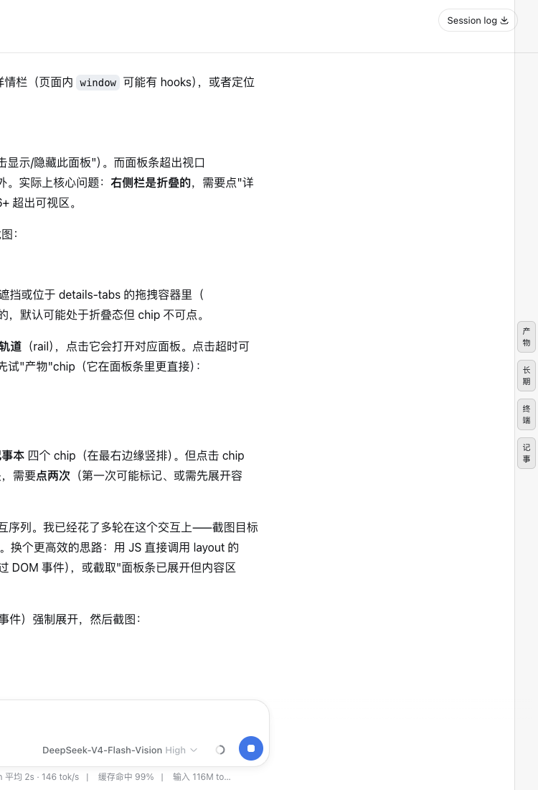

# dsh-minimal-UI-panels

> [English](./README.md) · [中文](./README.zh-CN.md)

<p>
  <a href="https://github.com/windrover/dsh-minimal-UI-panels"></a>
  <a href="https://github.com/windrover/dsh-minimal-UI-panels/blob/main/LICENSE"></a>
  <a href="https://github.com/windrover/dsh-minimal-UI-panels"></a>
  
  
</p>

> All-in-one DeepSeek Harness UI panels — 一个 bundle、一个 loader 行，包含右侧多面板详情栏 + 产物 + 长期记忆 + 终端 + 记事本。

`dsh-minimal-UI-panels` 把四个原本独立的 DSH 插件合并为一个包，并以**单 loader 行**挂载，避免多个插件互相抢占 `details` 槽。它同时提供宿主侧工具/路由与浏览器侧面板 UI，即插即用。

## ✨ 功能一览

| 面板 / 能力 | 说明 |
|---|---|
| **多面板详情栏容器** | 把右侧 `details` 栏变成 Blender 风格的多面板并列容器：左右/上下分割、拖动分隔条、拖拽合并/替换/关闭、面板条（chip）点击切换、DockRail 快速导航 |
| **产物面板** | 扫描工作区产物文件，按类型/日期/体积/行数分组排序；代码/配置/数据预览语法高亮；图片 base64 预览（4 MiB 上限）；mp4/m4v/webm/ogv 视频流式播放（支持 Range 请求） |
| **长期记忆面板** | 三作用域（user/global/workspace）记忆的查看、新增、搜索、编辑；标签分组；内容高亮；配套 `memory_*` 工具与 `/memory` 命令 |
| **终端面板** | 深色终端外观的 bash 命令执行器（`bash -lc`），输出收集后返回，下方常驻常用命令提示 |
| **记事本面板** | Apple 便签风格多条目记事：侧边列表 + 正文编辑、新建/删除、自动保存（600ms 防抖）、按首行自动命名，存储于 `~/.dsh/notes.json` |

## 📸 截图

右侧详情栏多面板效果（产物 / 长期记忆 / 记事本 / 终端）：



## 📦 安装

本包以本地 link 依赖挂载（与 DSH 本地插件一致）。编辑 `~/.dsh/profiles/web/package.json`：

```jsonc
{
  "dependencies": {
    "dsh-minimal-ui-panels": "link:/Users/Haoguangxing/Documents/DSH/dsh-minimal-UI-panels"
  },
  "dsh": {
    "profile": {
      "bundles": [
        "@deepseek-ai/dsh-base",
        "@deepseek-ai/dsh-web-app",
        "dsh-minimal-ui-panels"
      ]
    }
  }
}
```

然后在 profile 目录执行一次 pnpm 安装以建立 link：

```bash
cd ~/.dsh/profiles/web && pnpm install
```

最后重启 dsh web：**Ctrl+C 退出 → 重新 `dsh web` → 浏览器刷新**。loader 启动时扫描 profile bundles，新代码即生效。

> 若你之前挂载过那几个旧插件，请从 `dsh.profile.bundles` 列表移除它们（本包已取代）；同时清理 `~/.dsh/cordis.patch.yml` 中残留的旧行（如 `- id: artifacts-panel`），避免 `patch: entry ... not found` 告警。

## 🖥 使用

- 打开任意会话，点击右侧面板条的 chip 切换**产物 / 长期记忆 / 终端 / 记事本**。
- **终端**：输入命令回车执行（`bash -lc`），输出展示在下半区，常用命令提示常驻。
- **记事本**：点「新建」创建条目，左侧列表可拖动分隔条调宽，点击标题自动隐藏列表聚焦正文，工具栏可手动显示/隐藏列表。
- **`/memory`** 命令（宿主侧）：`/memory list|search|get|forget|export` 管理长期记忆。
- 宿主侧还提供模型工具：`memory_*`（write/recall/list/forget/export/import/correct/batch/diagnose）与 `artifacts_list`。

## 🏗 架构

```
dsh-minimal-UI-panels  (一个 loader 行 / 一个包)
│
├── lib/index.js  ── 宿主半身【薄组合入口】
│   └── import + 按序调用:
│       ├── lib/host/ltm.js              ← 原 dsh-long-term-memory（一字不改）
│       │     └── store.js / threats.js / llm.js / automation.js
│       ├── lib/host/artifacts.js        ← 原 dsh-artifacts-panel（一字不改）
│       └── lib/host/terminal-notes.js   ← 原 dsh-terminal-notes（一字不改）
│       inject = tools, systemPrompt, commands, settings, agents,
│                webServer, workspaceRegistry, subprocess, fs
│
└── lib/client.js  ── 浏览器半身【合并单 bundle = scripts/merge-client.mjs 生成】
    ├── function detailsTabs(react, react_jsx_runtime)   ← 原 dsh-details-tabs factory 体
    ├── function artifacts(react, react_jsx_runtime)     ← 原 dsh-artifacts-panel factory 体
    ├── function ltm(react, react_jsx_runtime)           ← 原 dsh-long-term-memory factory 体
    └── function terminalNotes(react, react_jsx_runtime) ← 原 dsh-terminal-notes factory 体
        每个 fn 末尾 return { apply, inject }
    └── function apply(ctx)   ← 主入口，依次调用 4 个 fn 的 apply
        顺序: container(details) → artifacts → ltm → terminalNotes
        (容器先挂载，子面板再注册进 details.tabs.item)

面板条 (details 栏): [产物] [长期记忆] [终端] [记事本]
宿主工具/路由:        memory_*(9) + artifacts_list, /api/artifacts/*, /api/terminal-notes/*
```

合并流程（详见 `scripts/merge-client.mjs`）：

```
dsh-details-tabs/lib/client.js  ─┐
dsh-artifacts-panel/lib/client.js├─ 提取 factory 体 → 改写 react/react_jsx_runtime
dsh-long-term-memory/lib/client.js│   绑定、删除子模块内 exports. 语句
dsh-terminal-notes/lib/client.js ─┘        │
                                           ▼
                            lib/client.js  (单 __ModuleLoader__.load bundle)
```

> ⚠️ **关键约定**：`__ModuleLoader__.load` 的 `id` 必须**精确等于包目录名**（本包为 `dsh-minimal-UI-panels`，含大写 UI）。loader 以目录 basename 作为 entry id，与 npm 包名大小写可能不同；不一致会导致启动报 `loaded without registering "..." via __ModuleLoader__.load`（fail-loud）。

## 🌐 宿主路由

与各原插件一致，未作变更：

| 方法 | 路径 | 说明 |
|---|---|---|
| POST | `/api/artifacts/scan` | 扫描目录 |
| GET | `/api/artifacts/read` | 读文件预览 |
| GET | `/api/artifacts/media` | 视频流（支持 Range） |
| POST | `/api/terminal-notes/exec` | 执行 bash 命令 |
| GET/POST | `/api/terminal-notes/notes` | 列出 / 新建记事 |
| GET/POST | `/api/terminal-notes/note` | 读 / 存单条记事 |
| POST | `/api/terminal-notes/note-delete` | 删除记事 |

## 🛠 开发与验证

- 改代码后先跑预检（DSH 插件工作流）：

  ```bash
  bash ~/.dsh/dsh-plugin-precheck.sh web
  ```

  预检会做：宿主插件树加载（`--dump-config`）+ 各插件 `node --check` + 客户端 bundle mock 装载契约断言。**通过后才允许重启**；进不去时用 `~/.dsh/dsh-safe-start.sh` 安全启动。

- 浏览器半身由仓库内脚本生成（收录自 `/tmp/merge-client.mjs`，已相对路径化）：

  ```bash
  node scripts/merge-client.mjs
  ```

  它会读取四个原始插件（作为本仓库的**兄弟目录** `../dsh-{details-tabs,artifacts-panel,long-term-memory,terminal-notes}/lib/client.js`），提取 factory 体、改写 react/`react_jsx_runtime` 绑定、删除子模块内 `exports.` 语句，输出 `lib/client.js`。重新生成后务必核对：`react_jsx_runtime` 有定义、子模块无残留 `exports.`、`__ModuleLoader__.load` 的 id 与目录名一致。

- 数据位置：长期记忆 `~/.dsh/dsh-memory/{global,user}.jsonl`、工作区 `.dsh/memory.jsonl`；记事本 `~/.dsh/notes.json`。

## 🔒 注意事项

- 记事本存储为单 JSON 文档（fs 服务无 unlink 原语，单文件原子重写更可靠）。
- details 列宽可在官方包 `dsh-client-ui-layout` 放宽（本包档案将上限调至 1600px，`computeColumns` 让步链保证中心对话区 ≥640px）——升级 dsh 会覆盖，需重打。
- 本包仅动态注册的服务/路由/工具随 fiber 生命周期；停止或热更新会移除全部副作用。
